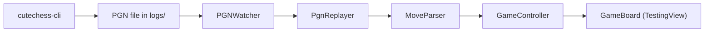

### 1. Understand current engine-vs-engine replay and display

- **Review core components**:
  - `[lib/game/match_manager.dart](lib/game/match_manager.dart)` orchestrates testing matches via `CutechessManager`, `PGNWatcher`, and `PgnReplayer`.
  - `[lib/game/pgn_watcher.dart](lib/game/pgn_watcher.dart)` detects new completed games in a PGN file and emits their movelists.
  - `[lib/game/pgn_replayer.dart](lib/game/pgn_replayer.dart)` parses those movelists through `MoveParser` and applies them to `GameController` with delays.
  - `[lib/game/move_parser.dart](lib/game/move_parser.dart)` converts SAN/UCI strings into `Move` objects using `ChessEngine.generateLegalMoves`.
  - `[lib/ui/testing_view.dart](lib/ui/testing_view.dart)` shows the non-interactive `GameBoard` plus testing controls and statistics.
- **Map data flow for testing mode** (from running cutechess to visual board):

### 2. Design the dedicated “Replay Logs” screen (no code changes yet)

- **Screen placement**:
  - Add a new `AppScreen.replayLogs` (or similar) to `HomePage` in `[lib/main.dart](lib/main.dart)` and a corresponding menu entry labeled “Replay Logs”.
  - Implement a new widget (e.g. `[lib/ui/log_replay_view.dart](lib/ui/log_replay_view.dart)`) that uses the existing `GameController` and `PgnReplayer` to visualize arbitrary PGN files.
- **Core UX for log replay**:
  - Left side: reuse `GameBoard` (non-interactive) to display the replayed game position.
  - Right side: panel with
    - A **PGN source selector**:
      - A list of recent PGN files detected from the project `logs/` directory.
      - A **“Browse…”** button to open a filesystem picker for any `.pgn` file (to satisfy the manual file picker preference).
    - Simple **replay controls**:
      - Load selected PGN
      - Play / Pause / Restart buttons, wired to `PgnReplayer` APIs or a thin wrapper.
      - A speed slider to adjust `_moveDelay` (e.g. 0–2000 ms) by calling `setMoveDelay`.
    - Optional: label showing current game number and result (if file contains multiple games).
- **Data interactions for replay screen**:
  - When the user picks a PGN file:
    - Read its contents.
    - Extract all games (can reuse logic from `PGNWatcher._parseAllGames` or factor it into a shared helper).
    - Show a list of games (e.g. “Game 1: White vs Black, result”) if multiple games exist; allow selecting a specific game to replay.
  - On “Play”:
    - Reset `GameController` to starting position.
    - Call `PgnReplayer.replayGameFromPgn` with the selected game’s PGN text.
- **Error feedback**:
  - If parsing fails on any move, capture and surface this:
    - Show the failing move string and its index.
    - Optionally highlight this in a simple move list panel (list of SAN moves with the first broken move in red).

### 3. Instrumentation to debug move parsing (read-only first)

- **Add diagnostic hooks (conceptual)**:
  - Plan to extend `PgnReplayer` and/or `MoveParser` to:
    - Emit events or structured logs when a move cannot be parsed, including:
      - PGN move string.
      - Move index and side to move.
      - Current FEN (by calling `ChessBoard.getFen()`).
      - Subset of generated legal moves in SAN and UCI.
    - Optionally expose a debug callback in `PgnReplayer` (e.g. `onMoveParsed`, `onParseError`) that the UI can subscribe to in the new log replay screen to show live diagnostics.
- **Cross-check against external viewer**:
  - For a handful of sample games (especially ones where knights and castling currently diverge):
    - Step through moves using the new replay screen and compare:
      - The board position on each ply vs. a trusted reference (e.g. Lichess) and note the **first divergent ply**.
      - The SAN and UCI of the legal move we actually apply vs. the SAN in the PGN.

### 4. Deep audit of `MoveParser.parseAlgebraic` logic

- **Review all notation variants present in project PGNs**:
  - From sample logs like `[logs/MyEngineV1_vs_Stockfish_Level_1_*.pgn](logs/)` and `[logs/MyEngineV1_vs_Stockfish_Level_2_*.pgn](logs/)`, catalog examples of:
    - Knight moves (`Nf3`, `Nxf7+`, with diverse disambiguation like `Nbd2`, `N1d2`).
    - Rook/queen disambiguation (`Rad1`, `R1d1`, `Qh4e1`).
    - Castling (`O-O`, `O-O-O`, possibly `0-0`, `0-0-0`).
    - Promotions (`e8=Q`, `exd8=N+`) and checks/mates.
- **Step-by-step reasoning over current implementation** in `[lib/game/move_parser.dart](lib/game/move_parser.dart)`:
  - Verify how `cleaned` SAN is produced (stripping check/mate markers and comments) and confirm that no useful disambiguation info is lost.
  - Ensure `_matchesAlgebraic`:
    - Correctly interprets **piece letter**, **file/rank disambiguation**, **captures**, **destination square**, and **promotion**.
    - Doesn’t wrongly reject valid knight/rook/bishop SAN because of overly strict assumptions.
  - Validate the **fallback matching** path that primarily matches on destination square and promotion; ensure it can’t pick an incorrect source piece when multiple pieces of the same type can reach the destination.
- **Map known failure patterns**:
  - Using the new debug data, write down specific examples where:
    - The correct move is legal but `_matchesAlgebraic` returns false.
    - The wrong legal move is accepted because disambiguation wasn’t applied or was parsed incorrectly.
    - Castling SAN is legal but `_findCastlingMove` or `parseAlgebraic` fails.

### 5. Hardening the move parser (conceptual changes only)

- **Clarify matching strategy**:
  - For each SAN, define a clear deterministic algorithm:
    1. Derive the target square, piece type, capture flag, promotion piece, and optional from-file/from-rank hints from the SAN alone.
    2. Enumerate all legal moves from `ChessEngine.generateLegalMoves` that match **piece type and target square**.
    3. Filter by **promotion**, **capture flag**, and **disambiguation hints**.
    4. If exactly one candidate remains, accept it; if zero, parse error; if multiple, log a diagnostic (this should be impossible for well-formed PGN).
  - Ensure castling SAN is a special-case path that:
    - Asks `generateLegalMoves` only for king moves and uses the **geometric two-file shift** from `e1`/`e8` rather than relying on `isCastling` from the C engine.
- **Knight and piece disambiguation fixes** (once failures are verified):
  - Tighten `_matchesAlgebraic` so that for non-pawn pieces:
    - We always parse and honor any file/rank hints and enforce them against `fromSquare`.
    - The presence of file/rank hints prevents the fallback from selecting a different piece of the same type.
  - Confirm that special knight move SAN patterns (e.g. `Nfd2`, `N1f3`) work across a battery of test positions.
- **Fallback behavior review**:
  - Evaluate whether the permissive fallback path (destination-only matching) should be disabled or more tightly constrained when SAN includes explicit source hints; this helps avoid silently picking the wrong piece.

### 6. Wire parser diagnostics into the new replay UI

- **Expose structured events** from `PgnReplayer` (conceptually):
  - On each parsed move: event with move index, SAN string, chosen `Move`, and FEN before/after.
  - On parse failure: event with move index, SAN string, FEN, and a short reason if available.
- **Display diagnostics in the log replay view**:
  - Add a small move list pane showing SAN moves with an indicator for the current ply.
  - Highlight the first move that fails to parse or diverges (e.g., red background, tooltip with diagnostic text).
  - Optionally show the **current FEN** and a compact list of legal moves at the failing position for debugging.

### 7. Validation strategy (manual + automated)

- **Manual validation through the UI**:
  - Use the new “Replay Logs” screen to:
    - Load various PGNs from `logs/` and arbitrary `.pgn` files via the manual picker.
    - Visually verify that the board position matches an external reference (e.g., Lichess) move by move, especially in games where knights and castling were previously broken.
- **Targeted unit/integration tests (if test harness exists or is created later)**:
  - Add tests for `MoveParser.parseAlgebraic` with sampled SAN strings from your logs, including:
    - Multiple pieces of the same type able to reach the same target square (to verify disambiguation).
    - Complex knight maneuvers, castling, and promotions.
  - Add tests for the PGN extraction helpers (shared between `PGNWatcher` and the new replay screen) to ensure games/moves are extracted identically in both places.

### 8. Implementation ordering

- **Phase 1 – New replay screen & wiring (safer UI work first)**:
  1. Introduce `AppScreen.replayLogs` in `HomePage` and hook a new menu item.
  2. Implement `LogReplayView` widget using the existing `GameBoard` and a new `PgnReplayer` instance or the existing one through a small wrapper.
  3. Implement PGN file discovery under `logs/` and add the manual file picker for arbitrary `.pgn` files.
  4. Implement game selection within a multi-game PGN and basic playback controls (play/pause/restart, speed).
- **Phase 2 – Diagnostics & parser hardening**:
  1. Add non-intrusive diagnostic hooks in `PgnReplayer` / `MoveParser` (events or structured logging) and surface them in `LogReplayView`.
  2. Use those diagnostics to identify concrete failing SAN patterns from real logs.
  3. Refine `MoveParser.parseAlgebraic` (especially knight and disambiguation handling, and castling) according to the clarified matching strategy.
- **Phase 3 – Regression verification**:
  1. Re-run engine-vs-engine tests and replay the resulting PGNs via the new screen, confirming that all knight moves, disambiguated piece moves, and castling lines now replay exactly as written.
  2. Optionally, add tests or a small script to batch-validate all PGNs in `logs/` by running them through `MoveParser` without UI.

