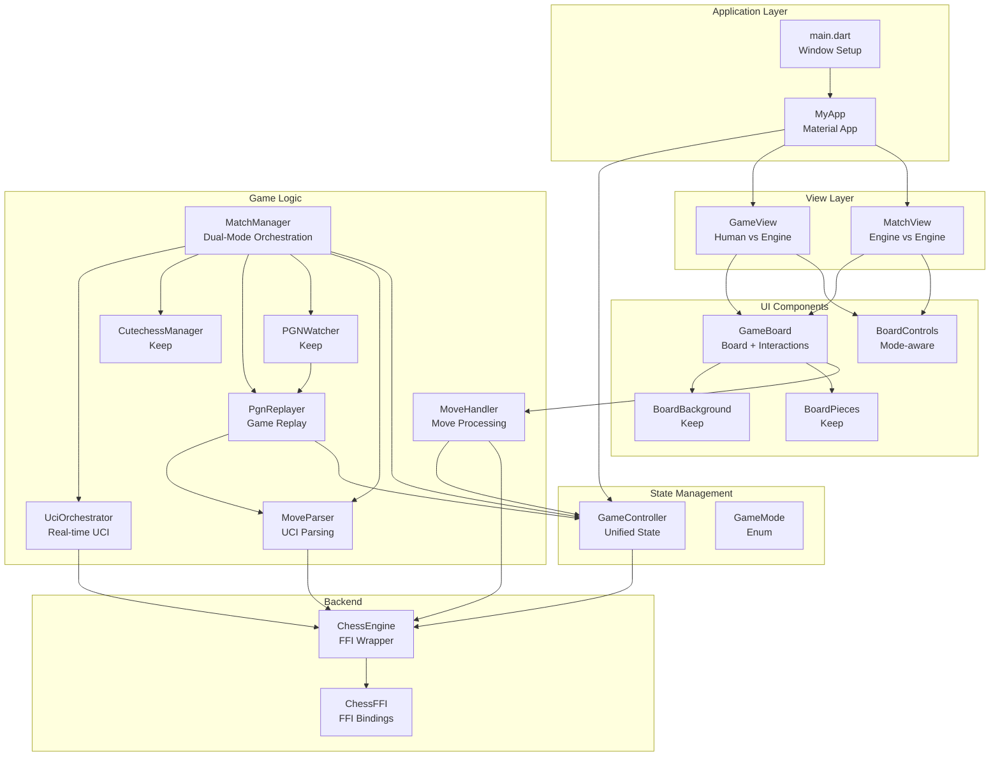

# Frontend Architecture Refactor Plan

## Current Pain Points

1. **Monolithic main.dart**: 560+ lines mixing UI, game logic, move handling, and engine match management
2. **Fractured state management**: State split between `GameController` and `_MyHomePageState` (markers, legalMoves, selectedIndex, engineMode)
3. **No engine match visualization**: PGN watcher emits moves but they're never applied to the board (solved with dual-mode system)
4. **Tight coupling**: Board, engine, controller passed as widget properties throughout
5. **Unclear game modes**: `engineMode` boolean doesn't distinguish match types
6. **Duplicated move handling**: Similar logic in `handleSquareTap` and `handlePieceDragEnd`

## New Architecture

### Component Structure

```
lib/
├── main.dart                    # Minimal: window setup, app initialization
├── game/
│   ├── chess_engine.dart       # Keep (FFI wrapper)
│   ├── chess_ffi.dart          # Keep (FFI bindings)
│   ├── game_controller.dart    # Enhanced: unified state management
│   ├── game_mode.dart          # NEW: Game mode enum and configuration
│   ├── match_manager.dart      # NEW: Unified match management (dual-mode)
│   ├── uci_orchestrator.dart   # NEW: Direct UCI communication for real-time
│   ├── pgn_replayer.dart       # NEW: PGN game replay with delay
│   ├── move_handler.dart       # NEW: Extracted move handling logic
│   ├── move_parser.dart        # NEW: UCI/PGN move parsing
│   ├── cutechess_manager.dart  # Keep (engine match orchestration)
│   └── pgn_watcher.dart        # Keep (PGN file monitoring)
└── ui/
    ├── board_background.dart   # Keep (board rendering)
    ├── board_pieces.dart        # Keep (piece rendering)
    ├── board_builder.dart      # Keep (layout builder)
    ├── game_board.dart         # NEW: Board widget with move handling
    ├── game_view.dart          # NEW: Main game view (human vs engine)
    ├── match_view.dart         # NEW: Engine vs engine visualization
    ├── board_controls.dart     # Refactor: Mode-aware controls
    └── engine_dropdown_button.dart # Keep
```

### Architecture Flow




## Dual-Mode Match System

### Visualization Mode (Real-time)

- Uses `UciOrchestrator` to communicate directly with engines via UCI protocol
- Engines run as separate processes, managed by orchestrator
- Moves are received in real-time as engines play
- Applied to board immediately for live visualization
- Best for: Watching matches as they happen, interactive viewing

### Testing Mode (ELO Testing with Replay)

- Uses `CutechessManager` to run official matches via cutechess-cli
- cutechess-cli handles match management, time controls, adjudication
- After each game completes, cutechess writes full game to PGN file
- `PgnReplayer` detects new games in PGN file via `PGNWatcher`
- Replays completed games with configurable delay (e.g., 500ms per move)
- Applied to board sequentially for visualization
- Best for: ELO testing, official matches, batch testing

### Flow Comparison

**Visualization Mode Flow**:

```
UciOrchestrator → Engine1 Process (UCI) → bestmove e2e4 → Parse → Apply to Board (instant)
                → Engine2 Process (UCI) → bestmove e7e5 → Parse → Apply to Board (instant)
```

**Testing Mode Flow**:

```
CutechessManager → cutechess-cli → Game 1 completes → PGN file updated
PGNWatcher → Detects new game → Extracts all moves → PgnReplayer
PgnReplayer → Apply move 1 (delay) → Apply move 2 (delay) → ... → Game complete
```

## Implementation Plan

### Phase 1: Core Infrastructure

#### 1.1 Create Game Mode Enum (`lib/game/game_mode.dart`)

- Define `GameMode` enum: `humanVsEngine`, `engineVsEngine`, `analysis`
- Each mode has configuration: player types, interaction rules
- Purpose: Replace boolean `engineMode` with type-safe enum

#### 1.2 Enhance GameController (`lib/game/game_controller.dart`)

- Add board selection state (selectedIndex, markers, legalMoves)
- Add game mode state
- Add match status (active, paused, finished)
- Methods:
  - `selectSquare(int index)` - Handle piece selection
  - `clearSelection()` - Clear selection state
  - `setGameMode(GameMode mode)` - Switch modes
  - `getLegalMovesForSquare(int square)` - Get moves for square

#### 1.3 Create Move Parser (`lib/game/move_parser.dart`)

- Parse UCI notation (e.g., "e2e4", "e7e8q") to `Move` objects
- Handle promotions, captures, castling
- Purpose: Convert PGN watcher moves to board moves

### Phase 2: Extract Move Handling

#### 2.1 Create Move Handler (`lib/game/move_handler.dart`)

- Extract move handling logic from `main.dart`
- Methods:
  - `handleSquareTap(GameController, int index)` - Process square tap
  - `handlePieceDrag(GameController, int from, int to)` - Process drag
  - `executeMove(GameController, Move move)` - Execute and validate move
  - `handlePromotion(GameController, Move move, BuildContext)` - Show promotion dialog
- Returns: `MoveResult` enum (success, invalid, promotion_required, game_over)

#### 2.2 Create Game Board Widget (`lib/ui/game_board.dart`)

- Combines `BoardBackground` and `BoardPieces`
- Handles tap/drag interactions
- Delegates to `MoveHandler` for logic
- Props: `GameController`, `onMove`, `interactive` (bool)
- Purpose: Reusable board component for both game modes

### Phase 3: Create View Components

#### 3.1 Create Game View (`lib/ui/game_view.dart`)

- Human vs Engine gameplay
- Uses `GameBoard` for display
- Uses `MoveHandler` for interactions
- Auto-plays engine moves after human moves
- Handles game over detection

#### 3.2 Create Match View (`lib/ui/match_view.dart`)

- Engine vs Engine visualization
- Uses `GameBoard` for display (non-interactive)
- Integrates `MatchManager` for move updates
- Shows match progress, game number, result
- Supports both modes:
  - **Visualization**: Real-time moves from UCI orchestrator
  - **Testing**: Replayed games from PGN with delay
- Mode selector UI (switch between visualization and testing)
- Replay controls (play/pause/speed for testing mode)

#### 3.3 Create UCI Orchestrator (`lib/game/uci_orchestrator.dart`)

- Direct UCI protocol communication with engines
- Manages engine processes (start, stop, communicate)
- Implements minimal UCI subset: `uci`, `isready`, `ucinewgame`, `position`, `go`, `bestmove`
- Parses `bestmove` responses to extract moves
- Emits moves in real-time as they're played
- Methods:
  - `startMatch(String engine1Path, String engine2Path, Map<String, String> options)`
  - `stopMatch()`
  - `Stream<UciMoveEvent> get moves` - Real-time move stream
  - `Stream<UciEvent> get events` - Engine events (ready, error, etc.)

#### 3.4 Create PGN Replayer (`lib/game/pgn_replayer.dart`)

- Replays completed games from PGN files
- Parses game moves from PGN format (UCI notation from movetext)
- Applies moves to board with configurable delay between moves
- Handles game reset between replays
- Integrates with `GameController` to apply moves
- Methods:
  - `replayGame(List<String> uciMoves, Duration moveDelay, GameController controller)` - Replay moves with delay
  - `replayGameFromPgn(String pgnText, Duration moveDelay, GameController controller)` - Parse and replay
  - `stopReplay()` - Stop current replay
  - `pauseReplay()` / `resumeReplay()` - Control replay state
  - `setMoveDelay(Duration delay)` - Adjust replay speed
  - `Stream<ReplayEvent> get events` - Replay progress events (move applied, game finished, etc.)

**Implementation Details**:

- Uses `MoveParser` to convert UCI strings to `Move` objects
- Applies moves via `GameController.makeMove()`
- Waits `moveDelay` between moves (default: 500ms)
- Resets board to starting position before each replay
- Handles game end detection (checkmate, stalemate, draw)

#### 3.5 Create Match Manager (`lib/game/match_manager.dart`)

- Unified interface for engine vs engine matches
- Dual-mode system:
  - **Visualization Mode**: Uses `UciOrchestrator` for real-time moves
  - **Testing Mode**: Uses `CutechessManager` + `PgnReplayer` for ELO testing with replay
- Wraps both systems and provides consistent API
- Converts moves via `MoveParser`
- Applies moves to board through `GameController`
- Emits match events (game started, move played, game finished)
- Methods:
  - `startMatch(MatchMode mode, String engine1, String engine2, ...)` - Start with mode
  - `stopMatch()` - Stop current match
  - `Stream<MatchEvent> get events` - Match events
  - `setReplayDelay(Duration delay)` - Configure replay speed for testing mode

**MatchMode Enum**:

- `MatchMode.visualization` - Real-time via UCI orchestrator
- `MatchMode.testing` - Use cutechess, replay completed games

### Phase 4: Refactor Main and Controls

#### 4.1 Refactor main.dart

- Minimal setup: window initialization, app creation
- Create `GameController` instance
- Route to appropriate view based on game mode
- Remove all game logic (move to components)

#### 4.2 Refactor BoardControls (`lib/ui/board_controls.dart`)

- Accept `GameMode` instead of `engineMode` boolean
- Show appropriate controls per mode:
  - Human vs Engine: New Game button, timers
  - Engine vs Engine: Start/Stop match, match status
- Remove hardcoded player names

### Phase 5: Integration and Testing

#### 5.1 Wire Everything Together

- Update `main.dart` to use new views
- Connect `MatchManager` to `MatchView`
- Connect `MoveHandler` to `GameView`
- Test mode switching

#### 5.2 UCI Protocol Implementation

- Implement minimal UCI protocol subset in `UciOrchestrator`
- Commands needed: `uci`, `isready`, `ucinewgame`, `position`, `go`, `quit`
- Parse responses: `readyok`, `bestmove <move>`, `info` (optional)
- No backend changes needed - all UCI communication in Dart
- Move parsing: Convert UCI notation (e.g., "e2e4") to `Move` objects via `MoveParser`

## File Changes Summary

### New Files

- `lib/game/game_mode.dart` - Game mode enum and config
- `lib/game/move_handler.dart` - Extracted move handling
- `lib/game/move_parser.dart` - UCI move parsing
- `lib/game/uci_orchestrator.dart` - Direct UCI communication for real-time visualization
- `lib/game/pgn_replayer.dart` - PGN game replay with configurable delay
- `lib/game/match_manager.dart` - Unified match management (dual-mode)
- `lib/ui/game_board.dart` - Reusable board component
- `lib/ui/game_view.dart` - Human vs engine view
- `lib/ui/match_view.dart` - Engine vs engine view (supports both modes)

### Modified Files

- `lib/main.dart` - Minimal refactor (remove logic, add routing)
- `lib/game/game_controller.dart` - Enhanced state management
- `lib/ui/board_controls.dart` - Mode-aware controls

### Unchanged Files (Keep As-Is)

- `lib/game/chess_engine.dart`
- `lib/game/chess_ffi.dart`
- `lib/game/cutechess_manager.dart`
- `lib/game/pgn_watcher.dart`
- `lib/ui/board_background.dart`
- `lib/ui/board_pieces.dart`
- `lib/ui/board_builder.dart`
- `lib/ui/engine_dropdown_button.dart`

### Backend Changes

- **Minimal**: Only if UCI parsing in Dart proves insufficient
- Preferred: Parse UCI moves in Dart using existing `Move` struct
- No changes to core engine logic

## Key Design Decisions

1. **Keep Board Components**: `BoardBackground`, `BoardPieces`, `BoardBuilder` are well-structured and reusable
2. **Unified State**: All game state in `GameController` via `ChangeNotifier`
3. **Mode-Based Views**: Separate views for different game modes for clarity
4. **Extract Move Logic**: Move handling separated from UI for testability
5. **Dual-Mode Match System**:
  - **Visualization Mode**: Direct UCI orchestrator for real-time moves
  - **Testing Mode**: cutechess-cli for ELO testing, PGN replay for visualization
6. **PGN Replay**: Completed games from cutechess are replayed with delay for visualization
7. **Minimal Backend Changes**: Parse UCI in Dart to avoid FFI changes

## Testing Strategy

1. Test move handling in isolation (`MoveHandler`)
2. Test UCI parsing with various move types
3. Test UCI orchestrator with mock engine processes
4. Test PGN replay with various game scenarios
5. Test mode switching between human/engine and engine/engine
6. Test dual-mode system (visualization vs testing)
7. Integration test: Full game flow in both modes
8. Test PGN replay delay and controls

